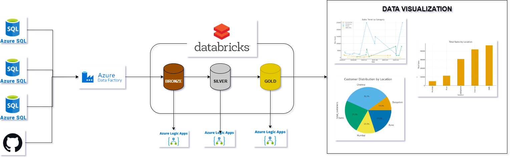
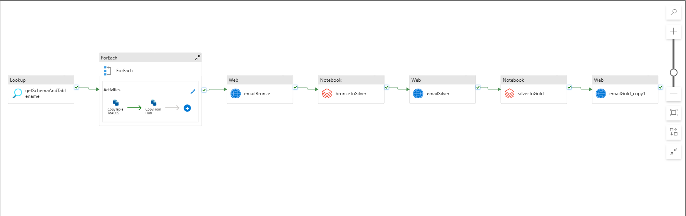
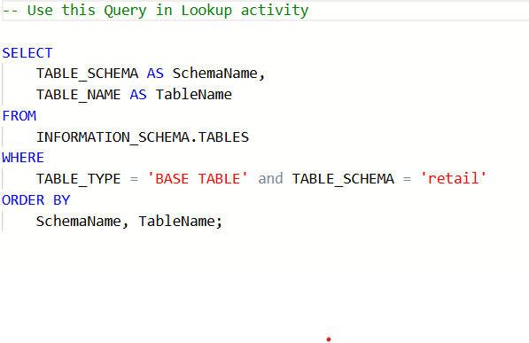
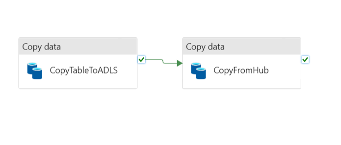
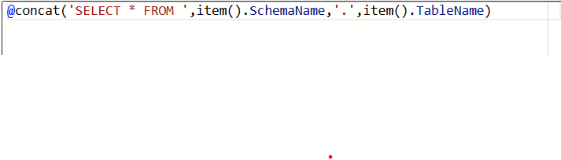
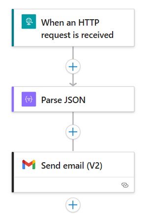
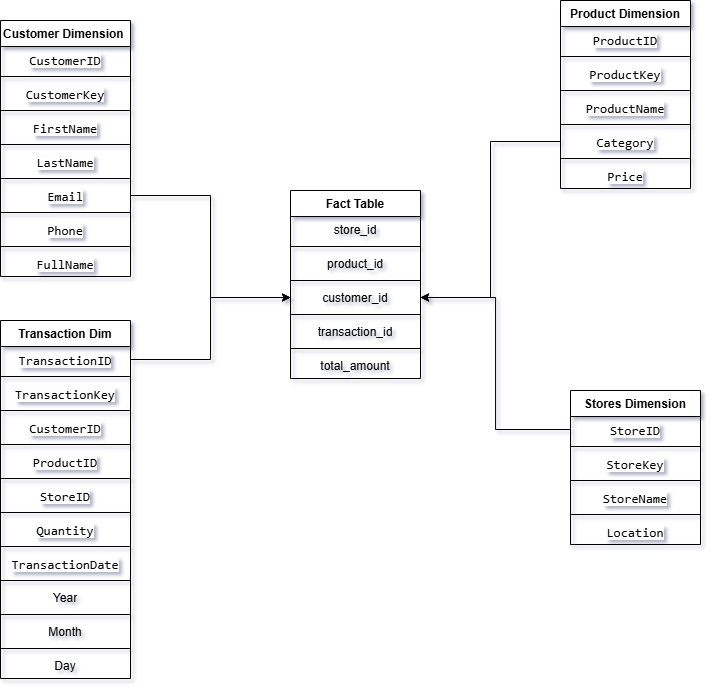
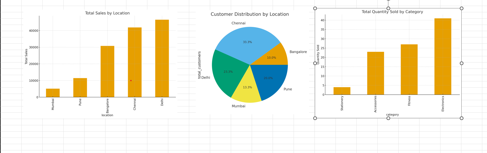

# ⭐ Azure Retail Insight Lakehouse

#### End-to-End Azure Data Engineering Project with Medallion Architecture

## 📖 Project Overview
Azure Retail Insight Lakehouse (ARIL) is a fully automated Azure Data Engineering solution designed to ingest, validate, transform, model, and visualize retail data coming from multiple sources.

This project demonstrates real-world, enterprise-grade practices using the **Medallion Architecture (Bronze → Silver → Gold)** along with workflow **Automation, Email Alerts, Transformations, and Analytics**.

#### Full Pipeline in ADF

## ✨ Key Features
🔹 1. Multi-Source Data Ingestion

  - Extract retail data from:
    - Azure SQL Database
    - GitHub raw files
  - Loaded into ADLS Bronze layer
  - Parallel ingestion for improved performance

  ## ✨ Data Creation
  First I have created a Schema & Multiple Tables inside Azure SQL Database, the code can be found [db.sql](db.sql).  
  After that I have upload [customers.json](customers.json) file in a github repsitory so that I can fetch it using an API request.
  
  First I have used a **LookUp Activity** and to get the Tables Names under the **Retail** Schema.
  
  
  ### ✨ Extract retail Data
  After that I have used a **ForEach** activity so I can ingest the data from the tables parallely. 
  Inside the **ForEach** I have two **Copy Activity** one for SQL Database and another to copy from Github,  
  
  
  Inside the first Copy this is the query to get the data from all the tables.  
  
  
  #### ✨ Logic App Email Confirmation
  After that i am send a **Confirmation Email** via a **LogicApp** for the completion of the bronze layer. I have actually created 2 more apps for silver and gold layers as well.  
  
  Logic App Design is same for each one just parameters are different. 
   
  
  **Now we have our data in out bronze layer.**

## ✨ Data Transformation (DataBricks)
  🔹 2. Automated Workflow  
        - On successful Bronze load → Logic App sends confirmation email 
        - Silver Databricks notebook triggers automatically 
        - It processes the data and saves the data in **Delta** format. 
        - On success → second confirmation email 
        Check out the notebook --> [bronzeToSilver.ipynb](bronzeToSilver.ipynb)

   **Now we have our data in out Silver layer.** 
        - Next Gold Databricks notebook triggers automatically 
        - It creates **Dimesion, Fact, Aggregrate tables**.
        - Also I have implemented star schema.
   

 **This entire workflow was done through Azure Data Factory**

 ## ✨ Data Analytics and Visualization
   🔹3. Downloaded the aggregrate file as csv and visualized data.
   

